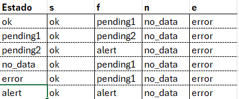

Projeto Final da Disciplina Linguagens Formais e Automata A-diurno

# Monitoramento de Sistemas Com Autômatos e Sensores: Uma Abordagem Prática
Autores:

  Leandro de Souza Mattos
  
  Humberto Turioni Marinho
  
  Pedro Braga dos Santos Bacellar
  
{mattos.leandro, humberto.turioni, pedro.bacellar}@aluno.ufabc.edu.br

# Tabela de Transição do Autômato:

# Representação do Autômato:

O repositório atual contém os seguintes arquivos:

"projeto automatos.ipynb": Arquivo Utilizado na Execução no Colab.

"projeto.jff": Arquivo Utilizado para a Representação no JFLAP.

"transition_table.xlsx" Arquivo Excel utilizado para representar a tabela de transição do Autômato.
